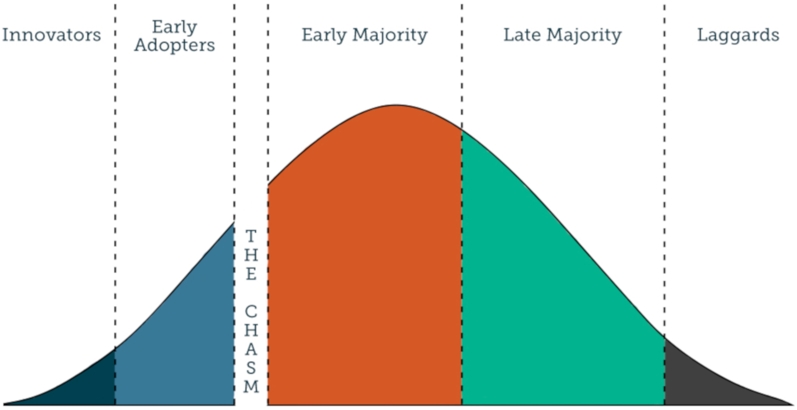

# Why Go Contracts Are A Bad Idea
## And What Might Work Better

---

## Go Generics With Contracts Proposal

```go
func Stringify(type T stringer)(s []T) (ret []string) {
	for _, v := range s {
		ret = append(ret, v.String())
	}
	return ret
}

contract stringer(x T) {
	var s string = x.String()
}
```

---

## Go Generics With Contracts


This is a very fundamental and long term decision!

Note:
- Python is still strugling to get version 3 fully adopted (since 2008).
- 'contracts' is still the official proposal. All criticism so far didn't change that.

---

## Go Community Changes



The Go community is changing as the majority enters it.

---

## The Majority Is Pragmatic

- They use Go to get a job done |
- They aren't interested so much in technical details |
- They use their tools in simple pragmatic ways |

Note:
- Pragmatic programmers can very well be better programmers.
- They often know the problem domain very well and it is better to solve
  the right problem in a simple, straight forward way than elegantly solving the wrong problem.
- Or even solving the (right or wrong) problem in an overengineered way.

---

## Let's Solve A Small Problem

- Articles should be assembled into a news page |
- Short articles with title and text |
- Long articles with additional abstract |
- All articles know how to render themself |

---?code=go/news1/news1.go&lang=Go&title=Assembling The News

@[5](the expected signature)
@[11](the article is really used)
@[5-14](all together)

---

## Writing The Contract

- We need a usage of the article type |
- The most successful, used and pragmatic pattern in programming is: copy & paste |
- Usually we would google such a usage and copy it from the internet |
- But this is an internal type so no usage available... |
- ...except the one we just wrote! |

---?code=go/news1/news1.go&lang=Go&title=Consequently The Contract Looks Like This

@[17](the expected contract signature)
@[18](convert the simple type into a slice)
@[26](replace return statements with '_ = ')
@[17-27](all together)

---

## Evaluation Of This Solution

- I don't have to understand what a contract really is or how it works |
- I just have to follow a small set of simple and formal rules |
- I exactly know that my real usage is supported |
- Only downside is readability |
- But not for me since I know about Render |
- I only feel the immediate upsides and don't feel the long term downside at all |

---

## Adding Highlight Articles And Dimensions

- Our solution is accepted by the PO |
- But marketing rejects it |
- They want highlight articles with an image |
- And better layout |
- Articles support a `Dimensions` method |

---?code=go/news2/news2.go&lang=Go&title=Assemble With Dimensions

@[7-13](search first highlight article)
@[14-17](if found, render highlight article)
@[19-21](don't forget highlight article)
@[22-31](render articles in rows)

---?code=go/news2/news2.go&lang=Go&title=Contract With Dimensions

@[36-37](the start is the same)
@[64-65](the end too)
@[38-63](the rest is just copied over)

---

## Supporting Newsletters

- Our solution is a success in the market |
- But now people want the great news in their inbox |

---?code=go/news3/news3.go&lang=Go&title=AddImages

@[7-13](search first highlight article)
@[14-17](if found, render highlight article)
@[19-21](don't forget highlight article)
@[22-31](render articles in rows)

---?code=go/news2/news2.go&lang=Go&title=Contract With AddImages

@[36-37](the start is the same)
@[64-65](the end too)
@[38-63](the rest is just copied over)

---

## Attributions

- Proposal: https://go.googlesource.com/proposal/+/master/design/go2draft-contracts.md
- Rune stone: By Henrik Sendelbach, CC BY-SA 3.0, https://commons.wikimedia.org/w/index.php?curid=256875
- Go community changes: https://www.youtube.com/watch?v=7yMXs9TRvVI
